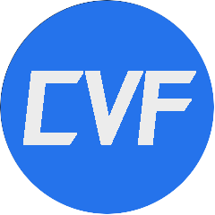

[![Contributors][contributors-shield]][contributors-url]
[![Forks][forks-shield]][forks-url]
[![Stargazers][stars-shield]][stars-url]
[![Issues][issues-shield]][issues-url]
[![MIT License][license-shield]][license-url]

 

  

  <h3 align="center">CuberVisualFramework</h3>

  

    基于ZeppOS的强大UI框架
    <a href="https://github.com/CuberQAQ/CuberVisualFramework/releases">Download</a>
    ·
    <a href="https://github.com/CuberQAQ/CuberVisualFramework/issues">Report Bug</a>
    ·
    <a href="https://github.com/CuberQAQ/CuberVisualFramework/issues">Request Feature</a>
  

  
Table of Contents

  <ol>
    <li>
      <a href="#about-the-project">About CVF</a>
    </li>
    <li>
      <a href="#getting-started">Getting Started</a>
      <ul>
        <li><a href="#prerequisites">Prerequisites</a></li>
        <li><a href="#installation">Installation</a></li>
      </ul>
    </li>
    <li><a href="#usage">Usage</a></li>
    <li><a href="#roadmap">Roadmap</a></li>
    <li><a href="#contributing">Contributing</a></li>
    <li><a href="#license">License</a></li>
    <li><a href="#contact">Contact</a></li>
  </ol>

## 什么是CVF
- CVF(CuberVisualFramework)是基于Zepp OS API的开源UI框架。
## CVF的特点 
- 将屏幕空间由二维扩展至三维，并通过3D视角模拟实现等立体的UI布局
- 组件、渲染与控制分离，扩展性强
- 高优化、低负载，常见情况达到60FPS
- 内置各种动画、控件与布局管理器
## CVF社区
### QQ交流群: 805214844
